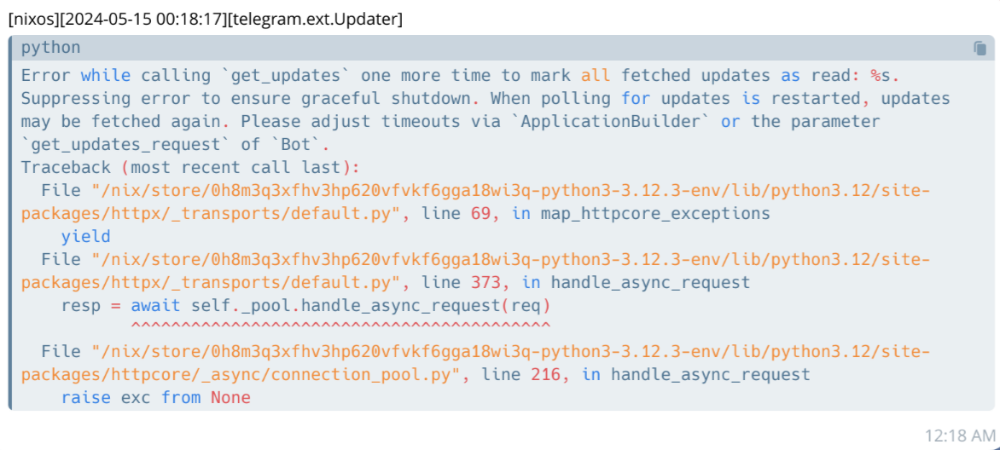

# telegram-output-monitor-bot
>  使用RabbitMQ将日志发送到你的Telegram



使用时修改文件名`cfg_sample.py`为`cfg.py`。

安装必要的包

```
pip3 install -r requirements.txt
```

确保能监听到本地的rabbitMQ服务。

> 注意，setup阶段会使用setup.sh下载一个pika封装`pika_interface.py`
